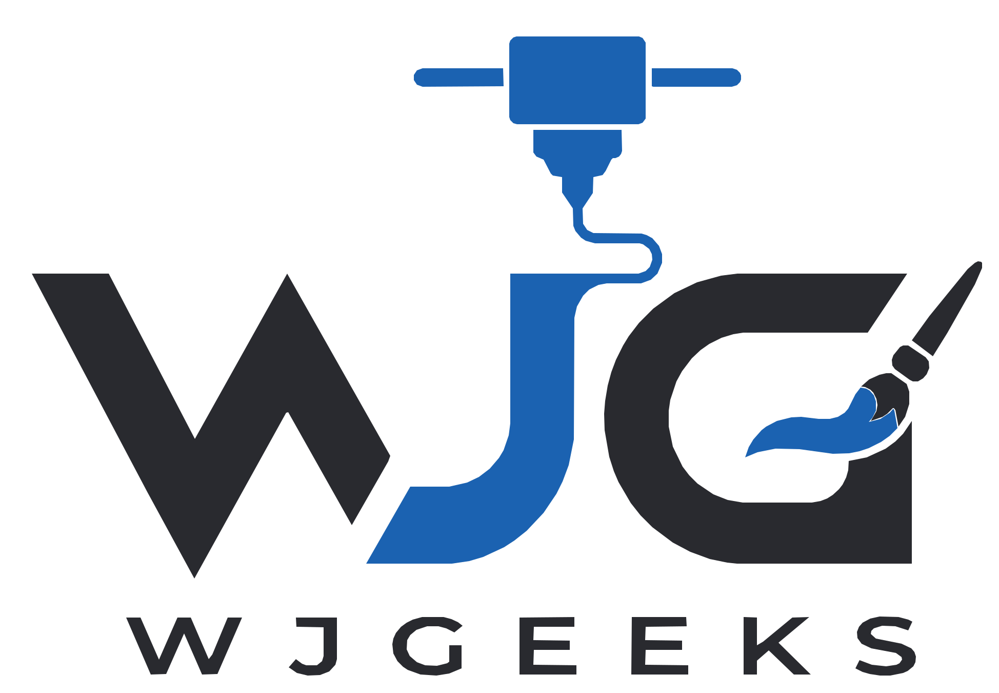

# WJGEEKS 3D — Plataforma de Cotización y Gestión de Impresión 3D

<div align="center">
  
  <p><strong>Sistema integral de cotización técnica, control de producción en taller, sincronización en la nube y generación de presupuestos para manufactura aditiva y resina artística.</strong></p>
</div>

---

## 🚀 Características Principales

### 1. 📐 Cotizador Técnico 3D Avanzado
- **Cálculo Geométrico en Tiempo Real:** Introduce dimensiones $X \times Y \times Z$ o utiliza el modo de **Gramos Exactos de Slicer** (Chitubox, Lychee, Bambu Studio o Anycubic Photon Workshop).
- **Desglose Exhaustivo de Costos:**
  - Consumo de resina con factor de merma y soportes (40% de taller).
  - Costo de energía eléctrica según tarifas kWh configurables.
  - Curado UV y químico (alcohol isopropílico / etanol al 96%).
  - Mano de obra especializada (diseño/desarrollo 3D, ensamblado y pintura artística).
  - Insumos de taller (herrajes, argollas, bisutería, pinturas acrílicas y empaque).
- **🟡 Modo de Cotización Parcial / Preliminar:** Permite guardar presupuestos dejando pendientes las medidas exactas o el consumo de resina para cuando se abra el archivo STL en los programas de laminación.

### 2. 📋 Historial de Cotizaciones Inteligente
- Búsqueda instantánea por número correlativo consecutivo (`#25-001`, `#25-074`, etc.), nombre de cliente o pieza.
- Filtro desplegable por cliente con contador dinámico.
- Ordenamiento personalizado:
  - ⚡ Más reciente a más antigua (predeterminado).
  - 🕰️ Más antigua a más reciente.
  - 👤 Por cliente (A-Z / Z-A).
  - 💰 Por mayor o menor monto.
- Pestañas por estado: *Todas, Parciales, Facturadas, Aceptadas, Enviadas y Borradores*.

### 3. 🏭 Pipeline de Taller (Órdenes de Trabajo)
- Convierte cualquier cotización aceptada en **Órdenes de Trabajo (OT)** para producción con un solo clic.
- Tablero de seguimiento de estados: *En Cola ➔ Imprimiendo ➔ Curado ➔ Pintura y Armado ➔ Control de Calidad ➔ Listo para Entrega*.
- Asignación de operadores, máquinas y control de tiempos.

### 4. 📄 Exportación PDF y WhatsApp
- Generación de documentos PDF profesionales de alta definición (con membrete, datos de pago bancario, Nequi, Daviplata y tablas detalladas).
- Envío directo de presupuestos y cuentas de cobro con formato estructurado por WhatsApp Web/Móvil.

### 5. ☁️ Sincronización en la Nube con Supabase
- Base de datos relacional PostgreSQL completa con políticas de seguridad **Row Level Security (RLS)** y **Realtime** habilitado para sincronizar estados entre múltiples dispositivos.

---

## 🛠️ Stack Tecnológico

- **Frontend:** React 19, TypeScript, Vite 6
- **Estilos:** Vanilla CSS con arquitectura de variables HSL, Glassmorphism y diseño responsivo adaptado a móviles
- **Base de Datos & Auth:** Supabase (PostgreSQL 15+)
- **Generación de Documentos:** jsPDF & jsPDF-AutoTable
- **Iconografía:** Lucide React
- **Efectos:** Canvas Confetti

---

## 📦 Estructura del Proyecto

```text
WJG/
├── public/                 # Favicon, manifiesto PWA y logos oficiales vectoriales
│   ├── wjg_logo_vector.svg
│   ├── wjg_logo_transparent.svg
│   └── wjg_logo_darkmode.svg
├── src/
│   ├── components/         # Módulos de la aplicación
│   │   ├── catalogos/      # Gestión de resinas, máquinas, insumos y tarifas
│   │   ├── cotizaciones/   # Listado histórico, filtros y ordenamiento
│   │   ├── cotizador/      # Calculadora 3D, modo parcial y generador de presupuestos
│   │   ├── cuentasCobro/   # Gestión de cuentas de cobro y abonos
│   │   ├── ui/             # Navbar, navegación móvil y componentes comunes
│   │   └── workflow/       # Pipeline Kanban de órdenes de trabajo (OT)
│   ├── data/               # Catálogos base y cotizaciones históricas
│   ├── services/           # Motores de cálculo, cliente Supabase, PDF y WhatsApp
│   └── types/              # Definiciones e interfaces TypeScript
├── supabase_schema.sql     # Script SQL maestro (Tablas, RLS, Políticas y Datos)
├── vercel.json             # Configuración de enrutamiento SPA para Vercel
└── package.json
```

---

## ⚡ Instalación y Ejecución Local

1. **Clonar el repositorio:**
   ```bash
   git clone https://github.com/artecapital25/WJG.git
   cd WJG
   ```

2. **Instalar dependencias:**
   ```bash
   npm install
   ```

3. **Configurar variables de entorno:**
   Copia el archivo `.env.example` como `.env` y coloca tus credenciales de Supabase:
   ```env
   VITE_SUPABASE_URL=https://tu-proyecto.supabase.co
   VITE_SUPABASE_ANON_KEY=tu-anon-key
   ```

4. **Iniciar en modo desarrollo:**
   ```bash
   npm run dev
   ```

5. **Construir para producción:**
   ```bash
   npm run build
   ```

---

## 🗄️ Base de Datos en Supabase (1 Clic)

El archivo [`supabase_schema.sql`](./supabase_schema.sql) contiene el esquema completo y todos los datos iniciales (clientes, resinas, máquinas, insumos y cotizaciones históricas).

1. Ingresa a tu panel de **Supabase ➔ SQL Editor**.
2. Abre una pestaña nueva (**New query**).
3. Pega todo el contenido de [`supabase_schema.sql`](./supabase_schema.sql).
4. Haz clic en **RUN**.

---

## 🌐 Despliegue en Vercel

1. Importa el repositorio desde tu cuenta de GitHub (`artecapital25/WJG`).
2. Configura las siguientes variables de entorno en Vercel:
   - `VITE_SUPABASE_URL`
   - `VITE_SUPABASE_ANON_KEY`
   *(O `NEXT_PUBLIC_SUPABASE_URL` y `NEXT_PUBLIC_SUPABASE_PUBLISHABLE_KEY`).*
3. Presiona **Deploy**.

---

## 📄 Licencia y Derechos

Desarrollado para **WJGEEKS 3D** & **ArteCapital**. Todos los derechos reservados.
